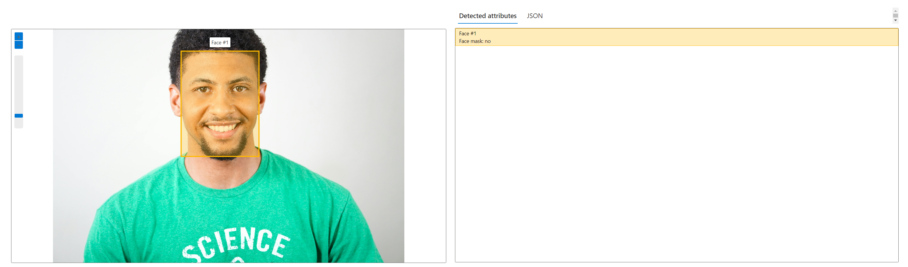
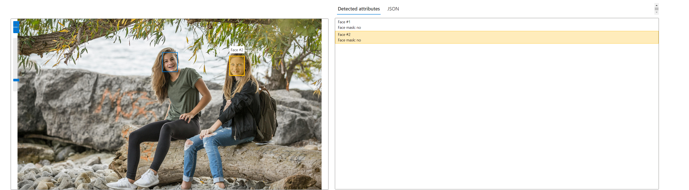
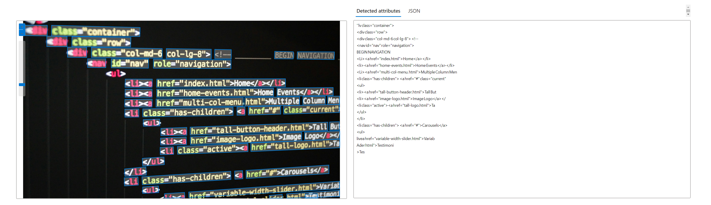
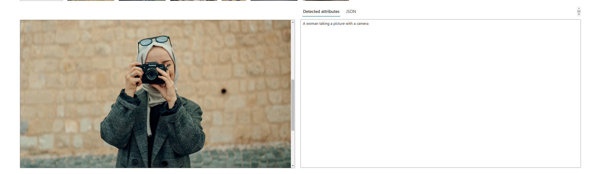

# dio-lab-azure-vision
Repositório para o projeto detecção facial e transformação de imagens em Dados no Azure ML

# Detecção facial
O serviço é capaz de detectar rostos em imagens, identificando suas localizações e atributos faciais.<br>
Ele pode identificar e analisar uma variedade de atributos faciais, incluindo idade, gênero, expressões faciais e pontos de referência faciais.

#### INPUT - APENAS UMA PESSOA
Imagem de entrada contendo apenas uma pessoa.<br>


#### OUTPUT - APENAS UMA PESSOA
A saída apresenta a quantidade de faces encontradas, e se estão utilizando mascára ou não. <br>



---

É possível analisar imagens com mais de uma pessoa:

#### INPUT - MAIS DE UMA PESSOA
Imagem de entrada contendo mais de uma pessoa.<br>


#### OUTPUT - MAIS DE UMA PESSOA
A saída apresenta a quantidade de faces encontradas, e se estão utilizando mascára ou não. <br>


--- 
# Extrair texto de imagens
A extração de texto de imagens, também conhecida como reconhecimento óptico de caracteres (OCR).<br>
O serviço é capaz de extrair texto de imagens, incluindo documentos digitalizados, fotografias de documentos impressos, placas de rua, menus de restaurantes, entre outros.

#### INPUT - IMAGEM COM TEXTO
Imagem de entrada contendo texto.<br>


#### OUTPUT - IMAGEM COM TEXTO
A saída apresenta o texto encontrado na imagem. <br>



--- 
# Geração de legendas para imagens
 O serviço é capaz de gerar automaticamente legendas descritivas para imagens, descrevendo o conteúdo visual da imagem em linguagem natural.<br>

#### INPUT - IMAGEM A SER LEGENDADA
Imagem de entrada .<br>


#### OUTPUT - IMAGEM A SER LEGENDADA
A saída apresenta o texto com a legenda do que seria a imagem. <br>


Legenda gerada:

```
a woman taking a picture with a camera

uma mulher tirando uma foto com uma câmera

```
 